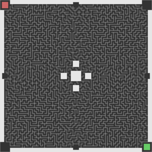

Welcome to Erbsland Maze
========================

Erbsland Maze is a sophisticated, open-source maze generator designed for creating complex, rectangular mazes. It exports mazes as SVG files, making them perfect for graphic design applications or even for 3D modeling. This tool stands out for its customization capabilities; it supports various endpoint configurations, allowing for connected or dead-end designs.

.. image:: docs/images/example_2.svg
    :width: 100%

Features
--------

- **Modular and Flexible**: Tailor your maze to fit any project requirement, from simple puzzles to complex labyrinth designs.
- **Customizable Endpoints**: Specify any number of endpoints, deciding whether they're interconnected or serve as individual dead-ends.
- **Design Freedom**: Freely position endpoints, incorporate blank areas for shaping the maze, and merge smaller rooms into larger spaces for aesthetic or functional purposes.
- **Path Customization**: Adjust room connections to guide the maze's pathways or to craft a unique template for your designs.

Requirements
------------

- Python 3.12
- The *pycairo* library.

## Requirements

To use Erbsland Maze, you'll need:

- Python 3.12 or higher.
- The `pycairo` library for rendering SVG files.

Quickstart Guide
----------------

Follow these steps to get started with Erbsland Maze:

#.  Clone the repository and navigate into it:

    .. code-block:: console

        git clone https://github.com/erbsland-dev/erbsland-maze/
        cd erbsland-maze

#.  Create and activate a new Python virtual environment:

    .. code-block:: console

        python3.12 -m venv venv
        source venv/bin/activate

#.  Install `pycairo`:

    .. code-block:: console

        pip install pycairo

#.  Generate your first maze:

    .. code-block:: console

        cd src
        python generate_maze.py -x 100 -y 100 -o maze.svg

    This command creates a `maze.svg` file in the `src` directory with your newly generated maze.

#.  For additional command-line options and configurations:

    .. code-block:: console

        python generate_maze.py --help

Documentation
-------------

You find all details about the library, it's design and file format in the `documentation`_.

Examples
--------

.. code-block:: console

    generate_maze.py -x 300 -y 300 -t 0.5 -e nw -e se -m w/3/1 -m nw/5 -m n/3/1 -m ne/5 -m e/3/1 -m se/5 -m s/3/1 -m sw/5 -b c/5 -b c/3/-6,0 -b c/3/6,0 -b c/3/0,-6 -b c/3/0,6 -f 2 -c ^m/w/3/1 -c ^m/nw/5 -c ^m/n/3/1 -c ^m/ne/5 -c ^m/e/3/1 -c ^m/se/5 -c ^m/s/3/1 -c ^m/sw/5

.. code-block:: console

    generate_maze.py -x 300 -y 100 -l 4 -t 2.5 -e w/10 -e e/10 -m w/3/10 -m e/3/10 -b nw/5 -b ne/5 -b se/5 -b sw/5

.. image:: docs/images/example_2.svg
    :width: 100%

.. code-block:: console

    generate_maze.py -x 200 -y 300 --height-parity=none --width-parity=none -l 4 -t 0.5 -e nw -e n/0/x -e ne/0/x -e e/20/x -e se -e s/0/x -e sw/1/x -m sw/2/1 -b w/2x67 -b ne/30x20/-4,12 -b se/30x20/-4,-12 -b e/20x43

.. image:: docs/images/example_3.svg
    :width: 100%

License
-------

Copyright © 2003-2024 Tobias Erbsland https://erbsland.dev/

This program is free software: you can redistribute it and/or modify
it under the terms of the GNU General Public License as published by
the Free Software Foundation, either version 3 of the License, or
(at your option) any later version.

This program is distributed in the hope that it will be useful,
but WITHOUT ANY WARRANTY; without even the implied warranty of
MERCHANTABILITY or FITNESS FOR A PARTICULAR PURPOSE.  See the
GNU General Public License for more details.

You should have received a copy of the GNU General Public License
along with this program.  If not, see <https://www.gnu.org/licenses/>.

.. _`documentation`: https://erbsland-dev.github.io/erbsland-maze/

